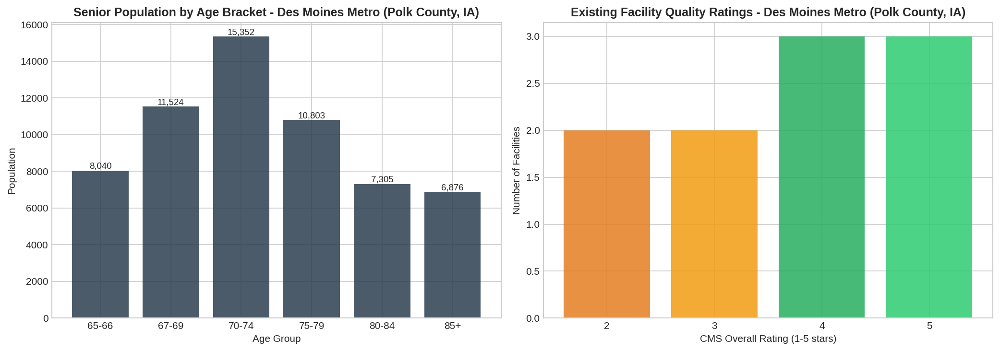
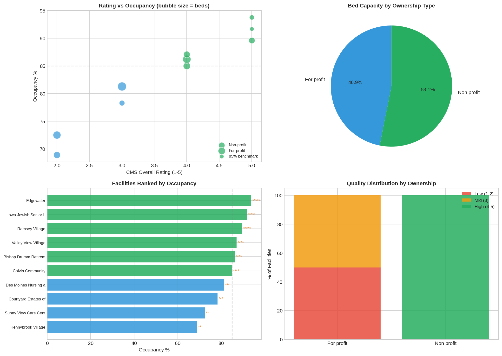
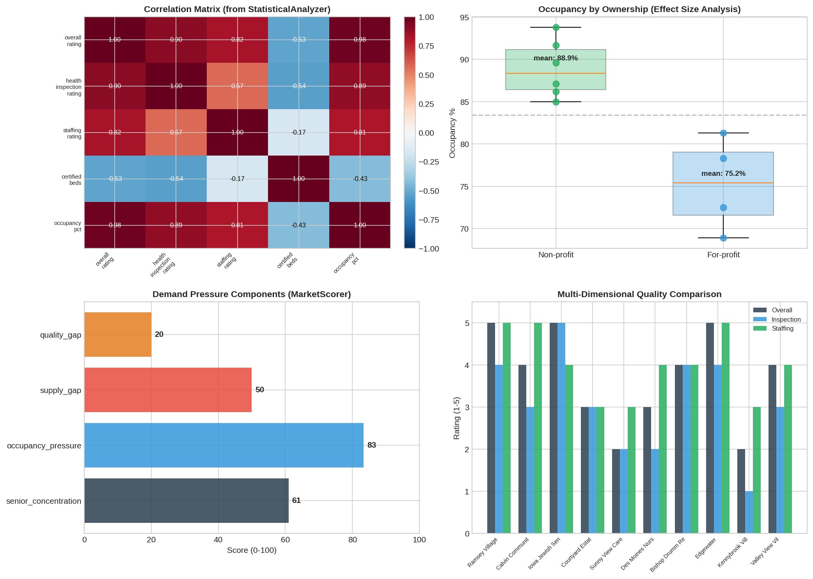

# Opportunity Intelligence Assistant
### Glenn Dalbey

---

**What this is**

An AI-powered market analysis assistant for senior living opportunity evaluation. It pulls public data from the Census Bureau and CMS Care Compare, runs it through a reusable analytics library I built, then uses an LLM to direct the statistical analysis and synthesize findings into an executive briefing with full citations.

The idea is that someone could ask "research the Des Moines market" and this pipeline would do the heavy lifting: pull the data, run the right analyses, and hand back a briefing where every number traces to a source.

**How it works**

Three LLM calls in an agentic loop:

1. The first call reviews the data profile and picks which statistical analyses to run from a library of 22 methods
2. The system executes those analyses, then the second call reviews results and requests more tests if it finds gaps
3. After both passes, the third call synthesizes everything into an executive briefing with citation tags

For the Des Moines demo, it planned 9 analyses on the first pass, then requested 5 more on follow-up for 14 total. The final briefing came out to 622 words with source tags on every claim. Total cost was about 6 cents in LLM tokens.

The analytics library is built as modular Python services in `src/` covering type inference, statistical analysis, anomaly detection, market scoring, and report compilation. These are designed to be reusable across different markets and datasets, not just this demo.

**Target market**

Des Moines, Iowa (Polk County). Chose it as a representative mid-size market with active senior living development. The system scored it 48.3/100 overall, which basically means there could be an opportunity here but you need to zoom into specific neighborhoods before committing capital. Demand pressure scored 53.6/100 and competitive position scored 40.3/100.

**Key findings from the analysis**

- 10 nursing facilities with 896 certified beds, averaging 83.4% occupancy
- Market is unconcentrated (HHI = 1,149), top 3 providers hold 44.6% of capacity
- Non-profits dominate the high-quality tier, 100% of non-profit facilities rated 4-5 stars
- Strong correlation between staffing quality and overall rating (r = 0.822)
- Two low-rated for-profit facilities running well below 85% occupancy, which is where a new entrant could compete
- Chi-square test confirms significant link between ownership type and rating tier (p = 0.0067)








**Future work**

- BLS employment data for healthcare workforce availability
- EMMA municipal bond filings to assess competitor financial health
- State health department inspection reports via PDF parsing
- Google/Yelp review sentiment analysis for quality-of-life signals
- Multi-market parallel execution for portfolio-level screening

**Sources**

- US Census Bureau ACS 5-Year Estimates (2022): demographics, income, housing
- CMS Care Compare Provider Data: nursing home quality ratings, beds, occupancy

**How to run**

```
conda create -n opportunity-intelligence python=3.11
conda activate opportunity-intelligence
pip install -r requirements.txt
jupyter notebook opportunity_intelligence.ipynb
```

Set `API_KEY` as an environment variable, or the notebook will use cached data for demo purposes. The cached data is real Polk County data so the full pipeline runs either way.

**Files**

```
opportunity_intelligence.ipynb       Main notebook
output/briefing.md                   Generated executive briefing
output/*.png                         Analysis charts and visualizations
src/statistical.py                   Statistical analysis service (22 methods)
src/type_inference.py                Column type detection and profiling
src/market_scoring.py                Demand pressure and opportunity scoring
src/anomaly_detection.py             Z-score and isolation forest detection
src/report_builder.py                Evidence packaging and report compilation
src/model_recommender.py             Analysis type recommendation engine
src/data_cleaning.py                 File loading and type casting
src/forecasting.py                   Time series forecasting service
requirements.txt                     Python dependencies
```
